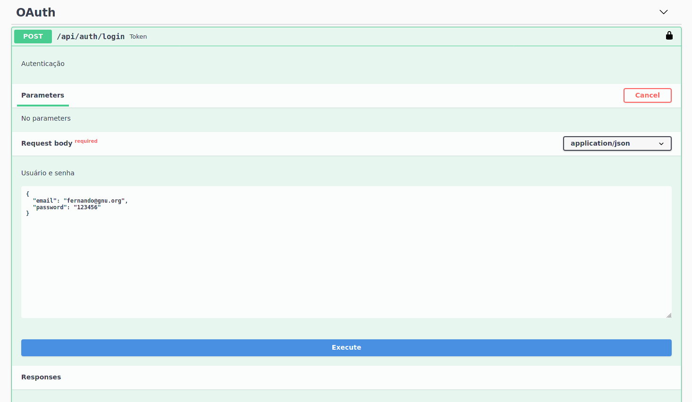
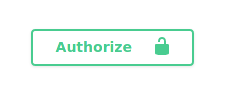
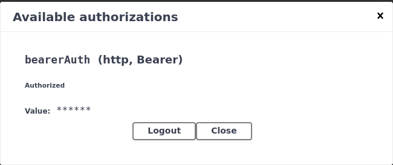

<!-- LOGO ELEPHPANT -->
<br />
<p align="center">
  <a href="https://github.com/ferox/testephp-ciet">
    
  </a>

  <h3 align="center">Teste de Conhecimento em PHP</h3>

  <p align="center">
    Processo de seleção para Desenvolvedor Drupal na CI&T
    <br />
    <br />
    <a href="https://github.com/ferox/testephp-ciet/issues">Reporte um bug</a>
    ·
    <a href="https://github.com/ferox/testephp-ciet/issues">Melhorias</a>
  </p>
</p>

<!--ÍNDICE -->
<details open="open">
  <summary>Índice</summary>
  <ol>
    <li>
      <a href="#sobre-o-teste">Sobre o Teste</a>
      <ul>
        <li><a href="#tecnologias-e-frameworks">Tecnologias e Frameworks</a></li>
      </ul>
    </li>
    <li>
      <a href="#iniciando">Iniciando</a>
      <ul>
        <li><a href="#prerequisitos">Prerequisito</a></li>
      </ul>
    </li>
    <li>
      <a href="#como-rodar-os-testes">Como rodar os testes</a>
      <ul>
        <li><a href="#teste_1">Teste 1</a></li>
        <li><a href="#teste_2">Teste 2</a></li>
        <li><a href="#teste_3">Teste 3</a></li>
        <li><a href="#teste_4">Teste 4</a></li>
        <li><a href="#teste_5">Teste 5</a></li>
        <li><a href="#teste_6">Teste 6</a></li>
        <li><a href="#teste_7">Teste 7</a></li>
      </ul>
    </li>
    <li><a href="#licença">Licença</a></li>
  </ol>
</details>

<!-- SOBRE O TESTE -->
## Sobre o Teste

Os exercícios deste repositório têm a intenção de avaliar o meu conhecimento em alguns tópicos da estrutura de Linguagem PHP e também em lógica de programação.

### Tecnologias e Frameworks

Aqui está a lista de todas as tecnologias usadas para a codificação da solução dos testes.
* [PHP](https://www.php.net/)
* [Material Design for Bootstrap](https://mdbootstrap.com/)
* [JQuery](https://jquery.com)
* [Laravel](https://laravel.com)
* [Laravel Passport](https://github.com/laravel/passport)
* [OAuth2](https://oauth.net/)
* [Swagger UI](https://swagger.io/tools/swagger-ui/)
* [SQLite](https://sqlite.org/index.html)


<!-- INICIANDO -->
## Iniciando

Clone o projeto para a sua máquina. Feito isso, acesse cada diretório e execute o php através da linha de comando. Note que há alguns testes que exigem o servidor web da própria linguagem.

### Prerequisitos

Certifique-se que o php, o composer e o sqlite3 estejam instalados em sua máquina.
* PHP na versão 7.3
  ```sh
  php -v
  ```
* Composer
  ```sh
  composer -V
  ```
* SQLite
  ```sh
  sqlite3 -version
  ```

  <!-- COMO RODAR OS TESTES -->
## Como rodar os testes

### Teste_1
* 
  ```sh
  php -f capitais_do_mundo.php 
  ```
### Teste_2
* 
  ```sh
  php -f joaozinho.php  
  ```
### Teste_3
* 
  ```sh
  php -f lista_extensao.php 
  ```
### Teste_4
* 
  ```sh
  php -S 127.0.0.1:8001 
  ```
* Acessar a URL pelo navegador: http://127.0.0.1:8001

### Teste_5
* 
  ```sh
  php -f conversor_xml_csv.php 
  ```
* Abrir o arquivo convertido evento_previdencia_privada.csv

### Teste_6
* 
  ```sh
  php -S 127.0.0.1:8001 
  ```
* Acessar a URL pelo navegador: http://127.0.0.1:8001

### Teste_7

  1. Criando o arquivo com as variáveis de ambiente do projeto de api com o Laravel
  ```sh
  cp .env.example .env
  ```
  1. Gerando a chave para a aplicação Laravel
  ```sh
  php artisan key:generate
  ```
  2. Criando o banco com o SQLite3 para persistir dados. O arquivo do banco precisa estar dentro do diretório database
  ```sh
  sqlite3 database.sqlite
  ```
  3. Instalando o Laravel e seus pacotes
  ```sh
  composer install 
  ```
  4. Criando o link simbólico do diretório storage dentro do diretório public
  ```sh
  php artisan storage:link 
  ```
  5. Criando a estrutura do banco e populando as tabelas
  ```sh
  php artisan migrate --seed 
  ```
  6. Criando as chaves de acesso e autenticação do Laravel Passport
  ```sh
  php artisan passport:install 
  ```
  7. Copie as credenciais fornecidas pelo Laravel Passport no arquivo .env
  ```sh
  API_ACCESS_CLIENT_ID=
  API_ACCESS_SECRET=
  ```
  8. Gerando a Documentação da API com o Swagger
  ```sh
   php artisan l5-swagger:generate
  ```
  9. Rodando a aplicação
  ```sh
   php artisan serve
  ```
  10. Acessando a Documentação da API pelo navegador: http://127.0.0.1:8000

  11. Gerando o Token para realizar consultas na API pelo Swagger. Clique no Schema OAuth -> Try it out -> Execute. Feito isso copie o token gerado.
  
  <p align="center">
    <a href="#">
        
    </a>
  </p>

  12. Agora é só inserir o token de autorização para consultas e clicar nos endpoints para Listar, Editar, Criar e Remover os registros. Primeiro clique em Authorize. Feito isso, cole o token no campo Value.
  
  <p align="center">
    <a href="#">
        
    </a>
  </p>

  <p align="center">
    <a href="#">
        
    </a>
  </p>

  13. Os dados da API também são persistidos em um arquivo txt que pode ser acesso pela url: http://127.0.0.1:8000/registros/api_usuarios.txt

<!-- LICENÇA -->
## Licença

Este projeto é distribuído através da licença BSL. Acesse o arquivo `LICENSE` do repo para mais informações.


  

